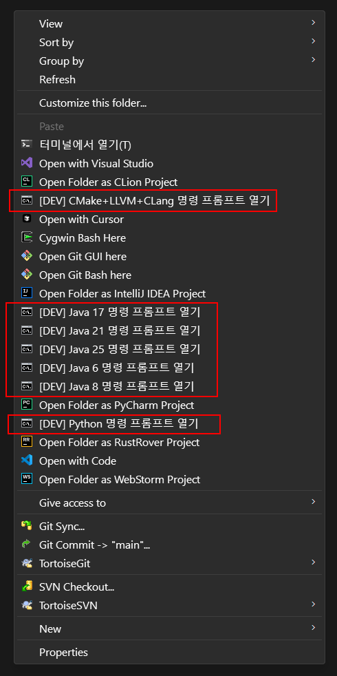

# 개발환경 명령 프롬프트들을 오른쪽 마우스 메뉴에서 사용하기

>  윈도우 탐색기에서 빌드도구 환경변수가 설정된 명령 프롬프트를 바로 띄울 수 있는 기능을 추가해보고 싶어서 진행했다. 
>
> 빌드 도구나 Java 버전 변경하고 싶으면 배치파일 속의 환경변수를 수정하면 됨.
>
> (원래는 etc의 하위에서 진행하던 내용인데 별도 리포지토리로 분리했음 😊)


## 개발 명령 프롬프트 정보

* ✨ Java 환경 명령 프롬프트

  * [java6_prompt.bat](java6_prompt.bat)
    * Java 6, Maven 3.2.5, ant 1.9.x
  * [java17_prompt.bat](java17_prompt.bat)
    * Java 17, Maven 3.9.x, Gradle 9.x, ant 1.10.x
  * [java21_prompt.bat](java21_prompt.bat)
    * Java 21, Maven 3.9.x, Gradle 9.x, ant 1.10.x
  * [java25_prompt.bat](java25_prompt.bat)
    * Java 25, Gradle 9.x, ant 1.10.x
      * Maven 4 부터 Java 25를 정식 지원해서, Maven 환경 변수는 설정하지 않음
* ✨Python 명령 프롬프트

  * [python_prompt.bat](python_prompt.bat)
    * Python 3.1.3
* ✨CMake + LLVM + Clang 명령 프롬프트

  * [cmake_prompt.bat](cmake_prompt.bat)
    * CMake, LLVM, Clang, MinGW-x64, Ninja는 사용가능한 최신 버전을 사용


## 설치

1. [setenv/default](setenv/default) 이하의 설정 배치 파일 내용에서 사전 경로를 보고 Java, Gradle, Maven, Ant, LLVM, Clang, Ninja, MinGW-x64 등이 약속된 경로에 준비가 되어있어야함 😅

   **필요한 디렉토리 구조:**
   ```
   C:\
   ├─ JDK\
   │  ├─ 6-oracle\      (Java 6)
   │  ├─ 8\             (Java 8)
   │  ├─ 17\            (Java 17)
   │  ├─ 21\            (Java 21)
   │  └─ 25\            (Java 25)
   ├─ Maven\
   │  ├─ 3.2.5\         (Maven 3.2.5 for Java 6)
   │  └─ 3.9.x\         (Maven 3.9.x for Java 8+)
   ├─ Gradle\
   │  ├─ 2.x\           (Gradle 2.x for Java 6)
   │  ├─ 7.x\           (Gradle 7.x for Java 8)
   │  └─ 9.x\           (Gradle 9.x for Java 17+)
   ├─ ant\
   │  ├─ 1.9.x\         (Ant 1.9.x for Java 6)
   │  └─ 1.10.x\        (Ant 1.10.x for Java 8+)
   ├─ CMake\
   │  └─ 3.x\           (CMake 3.x)
   ├─ LLVM\
   │  └─ 20.x\          (LLVM + Clang 20.x)
   ├─ MinGW-w64\        (MinGW-w64 15.1.0-posix-ucrt)
   └─ Ninja\
      └─ latest\        (Ninja 1.13.0)
   ```
   > - **Python**: 기본 설치 경로(`%LOCALAPPDATA%\Programs\Python\Python313`)를 사용하므로 별도 설정 불필요
   >
   > **💡 설치 팁:**
   > - **C 드라이브 기준**: Windows환경에 반드시 존재하는 C:\ 드라이브를 기준으로 경로 설정
   > - **정션 링크 활용**: 실제 바이너리는 다른 드라이브에 설치하고, C 드라이브에 정션 링크만 생성하면 관리가 편리함
   >   ```bash
   >   # 예시: 실제 바이너리가 설치된 경로 D:\Tools\JDK\17을 C:\JDK\17로 링크
   >   mklink /j C:\JDK\17 D:\Tools\JDK\17
   >   ```

2. 이 저장소를 다운로드 또는 클론하고 해당 경로를 윈도우 정션 링크를 걸어준다.

   * 로컬에 다운로드 또는 클론한 경로가 `c:\git\dev-command-prompt` 일 경우 다음과 같이 정션 링크

     ```text
     C:\>mklink /j CommandPrompt c:\git\dev-command-prompt
     ```

     ​	

3. shell_dev_prompt.reg 을 실행시켜 레지스트리에 등록 시킨다.

   * [reg/shell_dev_prompt.reg](reg/shell_dev_prompt.reg) 파일 내용
     
        ```reg
        Windows Registry Editor Version 5.00
        
        [HKEY_CLASSES_ROOT\Directory\Background\shell\java6_prompt]
        @="[DEV] Java 6 명령 프롬프트 열기"
        "Icon"="%ComSpec%"
        
        [HKEY_CLASSES_ROOT\Directory\Background\shell\java6_prompt\command]
        @="C:\\CommandPrompt\\java6_prompt.bat C:\\CommandPrompt \"%V\""
        
        [HKEY_CLASSES_ROOT\Directory\Background\shell\java8_prompt]
        @="[DEV] Java 8 명령 프롬프트 열기"
        "Icon"="%ComSpec%"
        
        [HKEY_CLASSES_ROOT\Directory\Background\shell\java8_prompt\command]
        @="C:\\CommandPrompt\\java8_prompt.bat C:\\CommandPrompt \"%V\""
        
        [HKEY_CLASSES_ROOT\Directory\Background\shell\java17_prompt]
        @="[DEV] Java 17 명령 프롬프트 열기"
        "Icon"="%ComSpec%"
        
        [HKEY_CLASSES_ROOT\Directory\Background\shell\java17_prompt\command]
        @="C:\\CommandPrompt\\java17_prompt.bat C:\\CommandPrompt \"%V\""
        
        [HKEY_CLASSES_ROOT\Directory\Background\shell\java21_prompt]
        @="[DEV] Java 21 명령 프롬프트 열기"
        "Icon"="%ComSpec%"
        
        [HKEY_CLASSES_ROOT\Directory\Background\shell\java21_prompt\command]
        @="C:\\CommandPrompt\\java21_prompt.bat C:\\CommandPrompt \"%V\""
        
        [HKEY_CLASSES_ROOT\Directory\Background\shell\java25_prompt]
        @="[DEV] Java 25 명령 프롬프트 열기"
        "Icon"="%ComSpec%"
        
        [HKEY_CLASSES_ROOT\Directory\Background\shell\java25_prompt\command]
        @="C:\\CommandPrompt\\java25_prompt.bat C:\\CommandPrompt \"%V\""
        
        [HKEY_CLASSES_ROOT\Directory\Background\shell\cmake_prompt]
        @="[DEV] CMake+LLVM+CLang 명령 프롬프트 열기"
        "Icon"="%ComSpec%"
        
        [HKEY_CLASSES_ROOT\Directory\Background\shell\cmake_prompt\command]
        @="C:\\CommandPrompt\\cmake_prompt.bat C:\\CommandPrompt \"%V\""
        
        [HKEY_CLASSES_ROOT\Directory\Background\shell\python_prompt]
        @="[DEV] Python 명령 프롬프트 열기"
        "Icon"="%ComSpec%"
        
        [HKEY_CLASSES_ROOT\Directory\Background\shell\python_prompt\command]
        @="C:\\CommandPrompt\\python_prompt.bat C:\\CommandPrompt \"%V\""
        
        ```
        
        * 아이콘은 특별히 쓸께 없어서 cmd의 아이콘을 그대로 사용함.

4. 바탕화면이나 탐색기에서 오른쪽 메뉴를 열면, 아래와 같은 화면이 나온다.
    


## 환경 변수 재정의(버전 재정의)가 필요할 경우 

[./setenv/user](./setenv/user) 경로에 [./setenv/default](./setenv/default) 안의 배치파일들을 복사해서, 재정의한다.

> user 경로에 오버라이드된 내용이 있다면 그것이 우선되는 방식이다.
